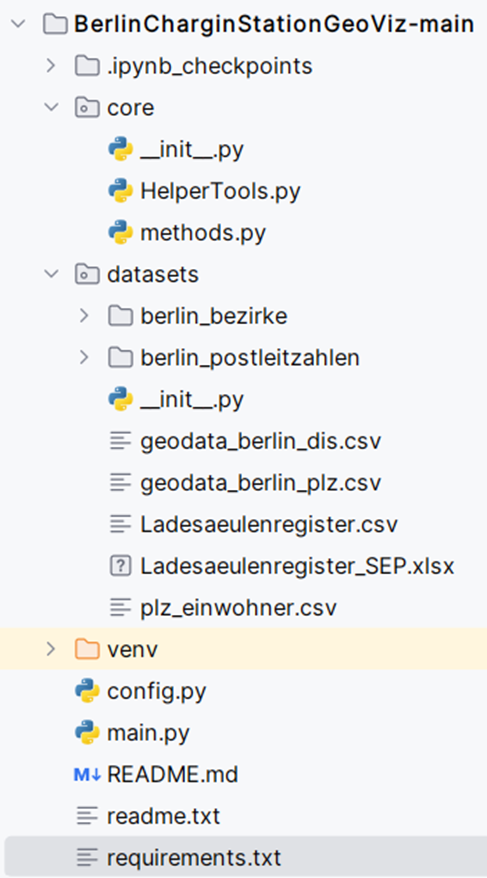
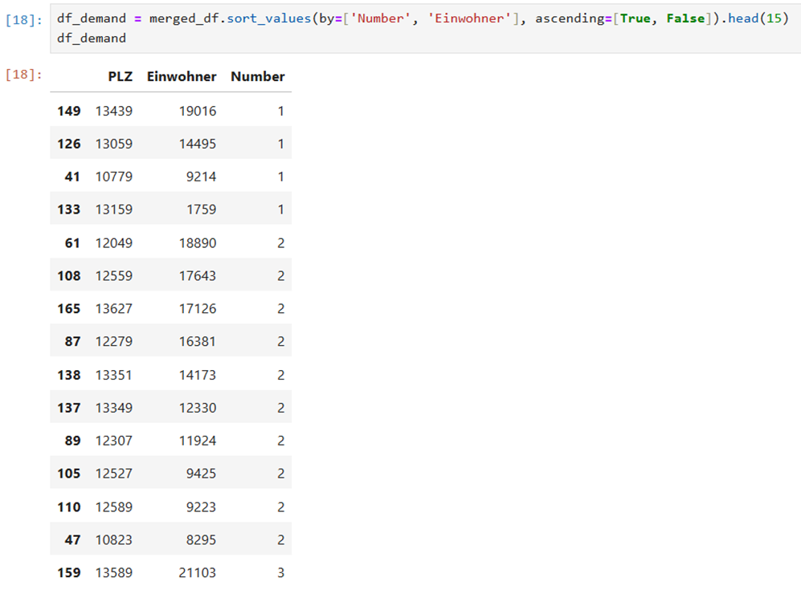

# BerlinCharginStationGeoViz
Contains the visualization of population density and electric charging station in the city of Berlin using geopandas visualization, Folium and hosting it on local server as well as on streamlit server.

## Code Structure Description


| Code Structure      | Description | 
| :---        |    :----  |   
 |<ul><li> **Core Functionality (core folder)**: HelperTools.py: Contains helper functions for general utilities, like timing functions.    methods.py: Contains core functions for data preprocessing and analysis. This includes data preparation steps for electric charging stations, geographical data, and population data. It also includes visualization logic. </li><li>**Datasets (datasets folder)**:    Contains various data files used for analysis: geodata_berlin_plz.csv: Geographical data of Berlin by postal code. Ladesaeulenregister.csv: Data about electric charging stations. plz_einwohner.csv: Population data by postal code.</li><li>**Configuration (config.py)** This file likely contains parameters or configurations used throughout the application to ensure consistent behavior.</li><li> **Main Application (main.py)** This is the main driver script that reads the data, processes it, and visualizes the results using a Streamlit web app. It integrates multiple data sources and runs preprocessing functions to generate geovisualizations. Uses functions from the core package to load, clean, and analyze the data. </li></ul>|

## Documentation (The main flow of the application)
1. Data Loading: main.py loads geographical, population, and charging station data from CSV files.

2. Data Preprocessing: Calls preprocessing methods from methods.py to prepare the data for analysis. This includes:
Merging population data with geographical data.
Counting the number of charging stations in each postal area.

3. Visualization: Uses Streamlit to create an interactive web-based heatmap visualization of the charging stations and residents. The visualizations are color-coded to highlight key regions in Berlin.

## Documentation (Heatmaps Interpretation and their Analysis)
1. Heatmap 1: **Electric Charging Stations**The first heatmap shows the distribution of electric charging stations across Berlin. Areas in red indicate regions with the highest density of charging stations.

2. Heatmap 2: **Population Density**The second heatmap illustrates the population distribution by postal code. Red areas represent regions with the highest population.

- ``` High Population with Low Charging Stations: Areas that are highlighted in red in the population heatmap but are yellow in the charging station heatmap indicate underserved regions. This suggests a high population with a low number of available electric charging stations.`

  

- ```Analysis of df1, df2, and df_demand pointed out areas with a mismatch between population density and charging station availability.```
